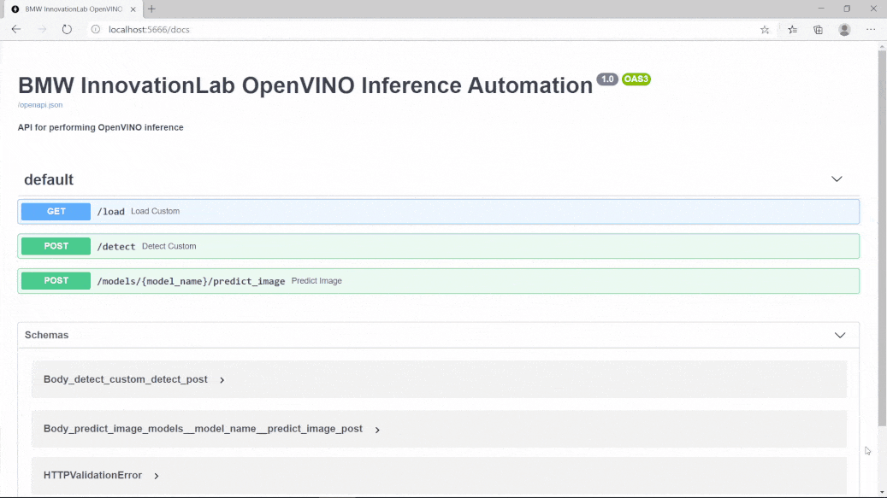
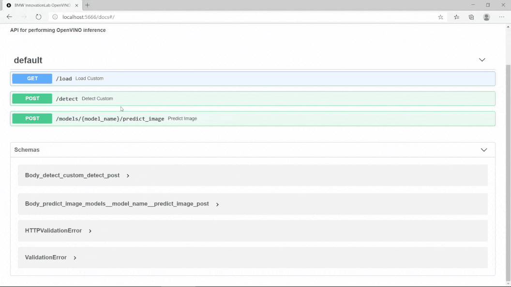
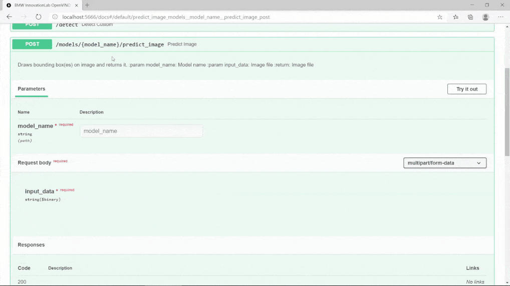

# OpenVINO Inference API 

This is a repository for an object detection inference API using the OpenVINO. It's supported on both Windows and Linux Operating systems.

Models in Intermediate Representation(IR) format, converted using the [Intel&reg; OpenVINO&trade; toolkit v2021.1](https://docs.openvinotoolkit.org/latest/index.html), can be deployed in this API. Currently, OpenVINO supports conversion for Models trained in several Machine Learning frameworks including Caffe, Tensorflow etc. Please refer to [the OpenVINO documentation](https://docs.openvinotoolkit.org/2021.1/openvino_docs_MO_DG_prepare_model_convert_model_Converting_Model.html) for further details on converting your Model.



## Prerequisites

- OS:
  - Ubuntu 18.04
  - Windows 10 pro/enterprise
- Docker

### Check for prerequisites

To check if you have docker-ce installed:

```sh
docker --version
```

### Install prerequisites

#### Ubuntu

Use the following command to install docker on Ubuntu:

```sh
chmod +x install_prerequisites.sh && source install_prerequisites.sh
```

#### Windows 10

To [install Docker on Windows](https://docs.docker.com/docker-for-windows/install/), please follow the link.

**P.S: For Windows users, open the Docker Desktop menu by clicking the Docker Icon in the Notifications area. Select Settings, and then Advanced tab to adjust the resources available to Docker Engine.**

## Build The Docker Image

In order to build the project run the following command from the project's root directory:

```sh
sudo docker build -t openvino_inference_api .
```
### Behind a proxy

```sh
sudo docker build --build-arg http_proxy='' --build-arg https_proxy='' -t openvino_inference_api .
```

## Run The Docker Container

If you wish to deploy this API using **docker**, please issue the following run command.

To run the API, go the to the API's directory and run the following:

#### Using Linux based docker:

```sh
sudo docker run -itv $(pwd)/models:/models -v $(pwd)/models_hash:/models_hash -p <docker_host_port>:80 openvino_inference_api
```
#### Using Windows based docker:

```sh
docker run -itv ${PWD}\models:/models -v ${PWD}\models_hash:/models_hash -p <docker_host_port>:80 openvino_inference_api
```

The <docker_host_port>  can be any unique port of your choice.

The API file will be run automatically, and the service will listen to http requests on the chosen port.

## API Endpoints

To see all available endpoints, open your favorite browser and navigate to:

```
http://<machine_IP>:<docker_host_port>/docs
```

### Endpoints summary

#### /load (GET)

Loads all available models and returns every model with it's hashed value. Loaded models are stored and aren't loaded again.


#### /detect (POST)

Performs inference on an image using the specified model and returns the bounding-boxes of the objects in a JSON format.



#### /models/{model_name}/predict_image (POST)

Performs inference on an image using the specified model, draws bounding boxes on the image, and returns the resulting image as response.



**P.S: If you are using custom endpoints like /detect, /predict_image, you should always use the /load endpoint first and then use /detect**

## Model structure

The folder "models" contains subfolders of all the models to be loaded.
Inside each subfolder there should be a:

- bin file (<your_converted_model>.bin): contains the model weights

- xml file (<your_converted_model>.xml): describes the network topology

- class file (classes.txt): contains the names of the object classes, which should be in the below format

  ```text
      class1
      class2
      ...
  ```
- config.json (This is a json file containing information about the model)

  ```json
    {
        "inference_engine_name": "openvino_detection",
        "confidence": 60,
        "predictions": 15,
        "number_of_classes": 2,
        "framework": "openvino",
        "type": "detection",
        "network": "fasterrcnn"
    }
  ```
  P.S:
  - You can change confidence and predictions values while running the API
  - The API will return bounding boxes with a confidence higher than the "confidence" value. A high "confidence" can show you only accurate predictions

The "models" folder structure should be similar to as shown below:

```shell
│──models
  │──model_1
  │  │──<model_1>.bin
  │  │──<model_1>.xml
  │  │──classes.txt
  │  │──config.json
  │
  │──model_2
  │  │──<model_2>.bin
  │  │──<model_2>.xml
  │  │──classes.txt
  │  │──config.json
```
## Acknowledgements

[OpenVINO Toolkit](https://github.com/openvinotoolkit)

[intel.com](https://intel.com)

[robotron.de](https://www.robotron.de/)
